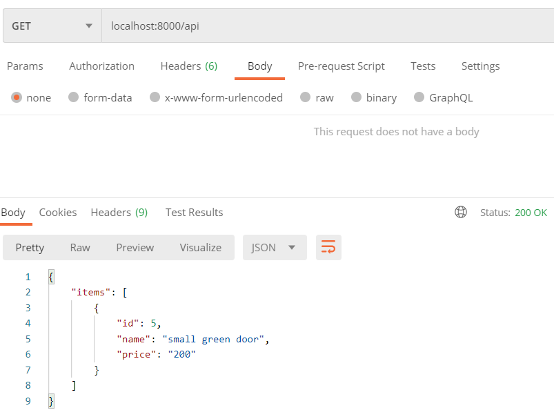

# Web development labs
## Lab 2 - OAuth authorization
### Requirments
- Python 3
  - django
  - django-allauth
 ```
 pip install django django-allauth
 ```
 
 ### Startup
 1. `cd <project directory>`
 2. `python manage.py runserver`
 3. open 127.0.0.1:8000
 
## Lab 3 - CRUD
### Requirments
- Python 3
  - django
  - django-rest-framework
  
### Results
#### Empty GET

#### POST

#### GET with posted item

#### PUT bad request

#### PUT success

#### PATCH success

#### GET final

